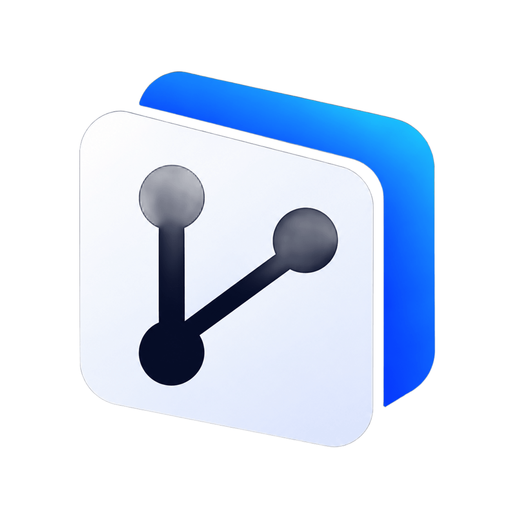
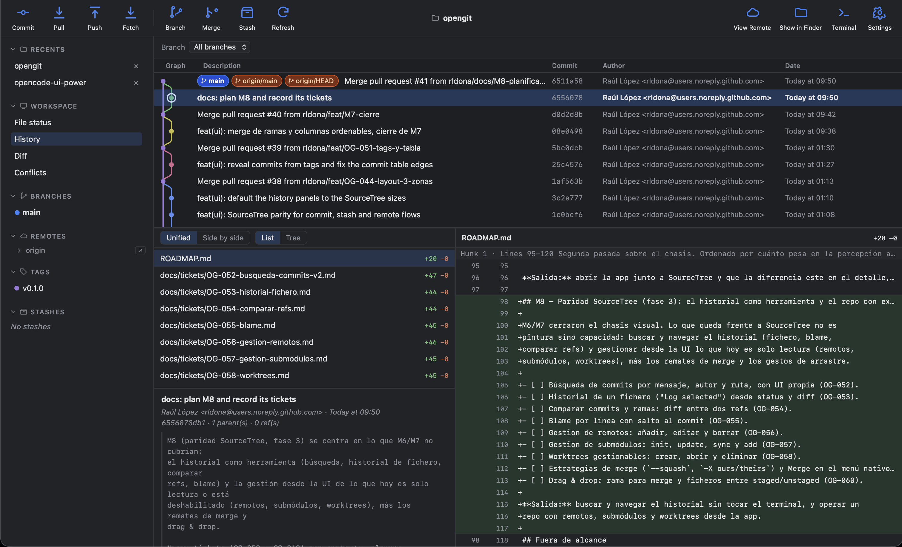

<p align="center">
  
</p>

<h1 align="center">OpenGit</h1>

<p align="center">
  Desktop Git client for Windows, macOS and Linux, inspired by SourceTree's UX:
  a readable graph, hunk staging and a sidebar with everything you touch daily.
</p>

<p align="center">
  <a href="https://github.com/rldona/OpenGit/actions/workflows/ci.yml"></a>
  <a href="https://github.com/rldona/OpenGit/releases/latest"></a>
  <a href="LICENSE"></a>
  
  
</p>

<p align="center">
  
</p>

## Download

Installers are published on [Releases](https://github.com/rldona/OpenGit/releases/latest).

| OS | Download | Format |
| --- | --- | --- |
| **Windows** | [OpenGit_x64-setup.exe](https://github.com/rldona/OpenGit/releases/download/v0.5.0/OpenGit_0.5.0_x64-setup.exe) · [OpenGit_x64.msi](https://github.com/rldona/OpenGit/releases/download/v0.5.0/OpenGit_0.5.0_x64_en-US.msi) | Installer / MSI |
| **macOS** (Apple Silicon) | [OpenGit_aarch64.dmg](https://github.com/rldona/OpenGit/releases/download/v0.5.0/OpenGit_0.5.0_aarch64.dmg) | DMG |
| **Linux** | [OpenGit_amd64.deb](https://github.com/rldona/OpenGit/releases/download/v0.5.0/OpenGit_0.5.0_amd64.deb) · [OpenGit_amd64.AppImage](https://github.com/rldona/OpenGit/releases/download/v0.5.0/OpenGit_0.5.0_amd64.AppImage) | Debian / AppImage |

The binaries are **not signed or notarized** (certificates cost money and this personal project does not pay for them), so the OS will warn you on first launch:

- **macOS:** open the `.dmg` and drag OpenGit to Applications. The app is
  **ad-hoc signed** (not notarized), so Gatekeeper blocks the first launch as
  coming from an unidentified developer; right-click the app → **Open**, or
  remove the quarantine attribute:

  ```bash
  xattr -dr com.apple.quarantine /Applications/OpenGit.app
  ```

  You have to repeat it if you copy the app again, because macOS re-adds the
  attribute.
- **Windows:** SmartScreen shows a warning. Click **More info** → **Run anyway**.
- **Linux:** install the `.deb` with `sudo apt install ./OpenGit_*.deb` or make the `.AppImage` executable.

## Features

- **Canvas commit graph** with incremental loading: smooth in repositories with tens of thousands of commits.
- **Diff with hunk, line and selection staging**, plus discard without leaving the app.
- **Image preview and comparison**: before/after for image changes over a transparency checkerboard (PNG, JPEG, GIF, WebP and friends).
- **SourceTree-style commit window**: pending files with staged/unstaged sections, file preview, `Commit Options…` (amend) and optional push immediately.
- **Complete sidebar**: branches, remotes, tags, stashes, submodules and worktrees, with context menus.
- **History operations**: merge, cherry-pick, revert, reset and interactive rebase with plan preview.
- **Block-based conflict editor** and an in-progress operation banner (abort, skip, continue).
- **Remotes** with an options dialog, streaming progress and cancel; credentials are handled by the system credential helper.
- **Navigable history**: branch filter, column sorting, search and an "Uncommitted changes" row.
- **Light/dark theme** and keyboard shortcuts.

## Status

**M7 completed** on 2026-09-19 (SourceTree parity: commit window, stashes, remote dialogs, sortable columns and merge). **M8 in progress** (commit search done): file history, comparing refs, blame and management of remotes, submodules and worktrees. Details in [ROADMAP.md](ROADMAP.md).

## Stack

| Area | Decision | ADR |
| --- | --- | --- |
| Desktop shell | Tauri 2 (Rust) | [ADR-0001](docs/decisions/) |
| UI | React + TypeScript | [ADR-0002](docs/decisions/) |
| Git engine | system `git` binary | [ADR-0003](docs/decisions/) |
| Commit graph | canvas + incremental loading | [ADR-0004](docs/decisions/) |
| Global state | Zustand | [ADR-0005](docs/decisions/) |

## Principles

1. **Git is the source of truth.** Git is never reimplemented: the system binary is orchestrated and its output parsed robustly (`-z`, `--porcelain=v2`).
2. **The UI never blocks.** Git operations run in separate processes with streamed output; the repository state is refreshed by watching `.git` with debounce.
3. **One codebase for the three OSes.** No parallel per-platform codebases.
4. **When in doubt, terminal.** Interactive rebase and destructive operations come late, with a safety net and never as the only path.

## Repository layout

```
OpenGit/
├── src/                       # React + TypeScript (UI)
├── src-tauri/                 # Rust (Tauri core)
├── assets/                    # Logo and screenshots
├── AGENTS.md                  # Instructions for agents (opencode, Claude, etc.)
├── README.md
├── ROADMAP.md
├── .github/workflows/         # CI: frontend, Rust and builds on the three OSes
├── .ai/                       # Agents, skills, workflows and memory
├── docs/
│   ├── architecture/          # Components and data flow
│   ├── decisions/             # ADRs
│   ├── guides/                # Development guides
│   └── tickets/               # Backlog, one file per ticket
└── LICENSE
```

## Documentation

- [ROADMAP.md](ROADMAP.md) — milestones and exit criteria.
- [docs/tickets/](docs/tickets/README.md) — backlog, one file per ticket.
- [docs/architecture/overview.md](docs/architecture/overview.md) — components, data flow and performance budget.
- [docs/decisions/](docs/decisions/README.md) — ADRs.
- [docs/guides/development.md](docs/guides/development.md) — environment, commands and conventions.
- [AGENTS.md](AGENTS.md) — rules for agents working on the repo.

## Quick start

Requirements: Node.js 22+ and a stable Rust toolchain (see [docs/guides/development.md](docs/guides/development.md)).

```bash
npm install
npm run tauri dev
```

## License

MIT — see [LICENSE](LICENSE).
